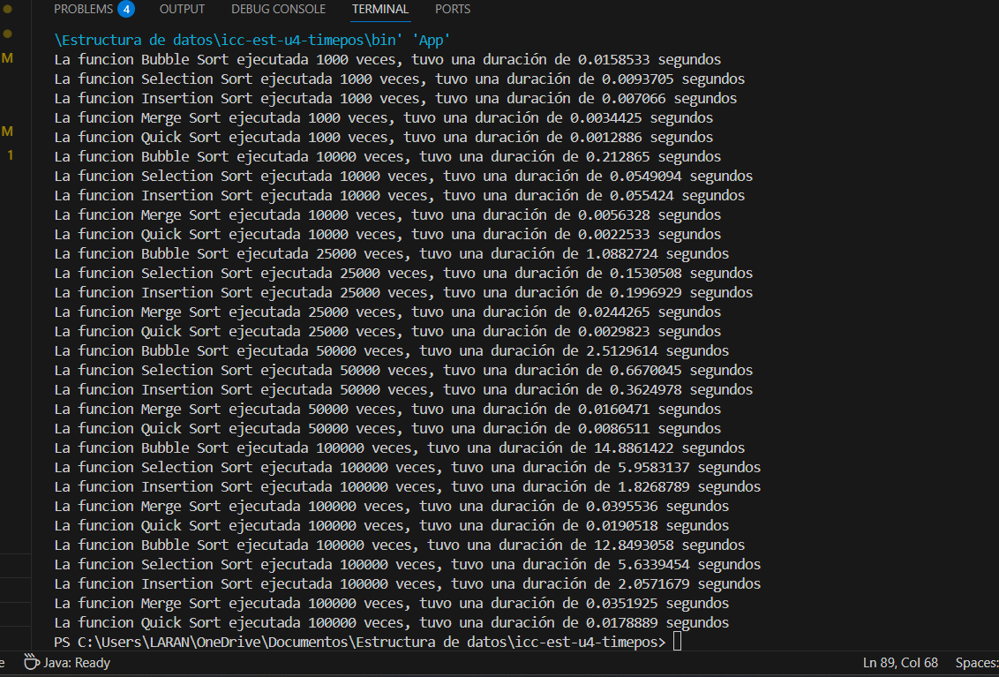

### Estructura de datos

## Nombre: Juliana Torres

## Benchmarking de Algoritmos de Ordenamiento en Java

Descripción del Proyecto
Este proyecto implementa y compara el rendimiento de cinco algoritmos de ordenamiento clásicos en Java:
- Bubble Sort
- Selection Sort
- Insertion Sort
- Merge Sort
- Quick Sort
Cada algoritmo se ejecuta sobre arreglos de diferentes tamaños (1000, 10000, 25000, 50000, 100000) y se mide el tiempo de ejecución usando System.nanoTime() para obtener precisión en nanosegundos.

## Resultados

